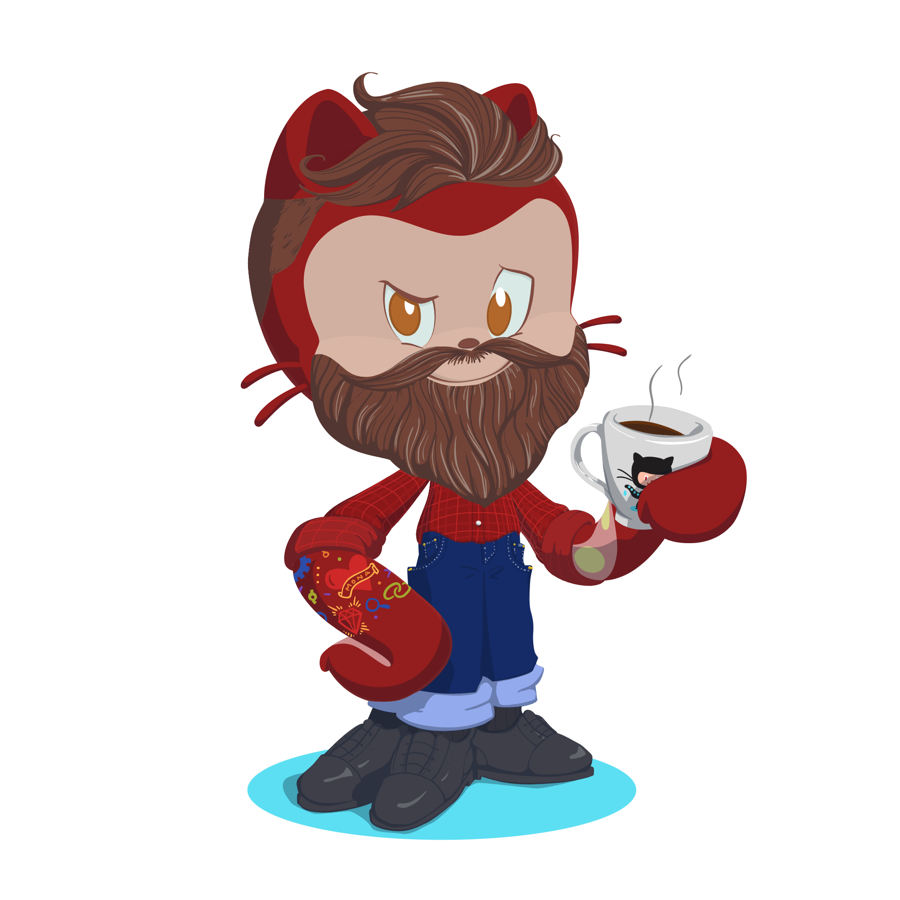

<link rel="stylesheet" type='text/css' href="https://cdn.jsdelivr.net/gh/devicons/devicon@latest/devicon.min.css" /> 

# Hello! I'm Jhonatan!

|  |• Brazilian, 28 years old   • I'm from São Paulo, SP   • Studying to be a FullStack Developer   • Currently, I'm a Senior Electronic Technician  |
|-|:-|

## Currently Learning

  
  
  
  
  
  

## Contact-me:

   
  

